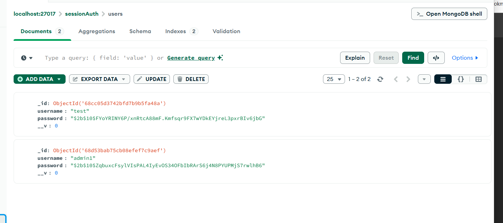

# Simple Auth

## Test với Postman
Run file app.js: node app.js
Ảnh request register:  
Tiến hành đăng ký tài khoản với đường dẫn local/register trong POSTMAN với phương thức POST

Check in database xem có đã được lưu chưa

tiến hành login và xem kết quả, thành công sẽ hiển thị thông báo "Login successful!"

Check in database xem đã được lưu session chưa

go to profile: dùng phương thức GET để xem thông tin, thành công sẽ trả về thông báo tên người dùng

go to logout and check cookie is deleted in database: kết quả sau khi logout thì DB cũng xóa luôn cookie

